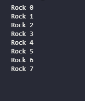

# 5.1 用构造器确保初始化

[**返回**](../menu)

- 在Java中,通过提供构造器,类的设计者可确保每个对象都会得到初始化.  
- 创建对象是,如果具有构造器,Java就会在用户有能力操作对象之前自动调用相应的构造器,从而保证了初始化的进行.  
- 构造器采用与类相同的名称  
  - 第一,采取任何名字都可能与类的某个成员名称冲突  
  - 第二,调用构造器是编译器的责任,所以必须让编译器知道应该调用哪个方法  

```java
//:initialization/SimpleConstructor.java
//Demonstration of a simple constructor
class Rock{
    Rock(){ //this is the constructor
        System.out.println("Rock "):
    }
}

public class SimpleConstructor{
    public static void main(String[] args){
        for(int i=0;i<10;i++)
            new Rock();
    }
}///:~
```


- 由于构造器名称必须与类名完全相同,所以**每个方法首字母小写**的编码风格**并不适用于构造器**  
- **默认构造器(default constructor)**: 不接受任何参数的构造器  

```java
//initialization/SimpleConstructor2
//Constructor can have arguments
Class Rock2{
    Rock2(int i){
        System.out.println("Rock " + i +"   ");
    }
}

public class SimpleConstructor2{
    public static void main(String[] args){
        for(int i=0;i<8;i++)
            new Rock2(i);
    }
}
```



- 有了构造器形式参数,就可以在初始化对象时提供实际参数.  
- 构造器有助于减少错误,并使代码更容易于阅读.  
  - 从概念上将, _初始化_ 和 _创建_ 是彼此独立的  
  - 在Java中,**初始化和创建是捆绑在一起的,两者不能分离**  
- 构造器是一种 _特殊类型方法_ ,因为它**没有返回值**
  - 构造器**不会返回任何东西**  
  - 假如构造器具有返回值,并且允许人们自行返回类型,**势必得让编译器知道该如何处理此返回值**  

[**返回**](../menu)