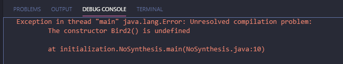

# 5.3 默认构造器  

[**返回**](../menu)

- 如果你写的类里面没有构造器,**则编译器会自动帮你创建一个默认构造器**  

```java
//:initialization/DefaultConstructor.java
class Bird(){}

public class DefaultConstructor{
    public static void main(String[] args){
        Bird b=new Bird(); //Default !!!
    }
}
///:~
```

- 如果已经定义了一个构造器(无论是否有参数),**编译器就不会帮你自动创建默认构造器**

```java
//:initialization/NoSynthesis.java
class Bird2{
    Bird2(int i){}
    Bird2(double d){}
}

public class NoSynthesis{
    public static void main(String[] args){
        //! Bird2 b=new Bird2() //No Default
        Bird2 b2 = new Bird2(1);
        Bird2 b3 = new Bird2(1.0);
    }
}
///:~
```



[**返回**](../menu)