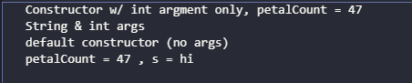

# 5.4 this关键字  

[**返回**](../menu)

## 导航  

1. [5.4.1 在构造器中调用构造器](#541-在构造器中调用构造器)  
2. [5.4.2 static的含义](#542-static的含义)  
  
- **this关键字**只能在方法内部使用,表示**调用方法的那个对象**的引用.  
  - 如果在方法内部调用同一个类中的另一个方法就不必使用this.  
  - 只有当需要明确指出当前对象的引用时,才需要使用this关键字  
  
  > 使用例：返回当前对象的引用  

    ```java
    //:initialization/Leaf.java
    //Simple use of the "this" keyword
    //usage : return the reference of the current object
    public class leaf{
        int i=0;
        Leaf increment(){
            i++;
            return this;
        }

        void print(){
            System.out.println("i="+i);
        }
        public static void main(String[] args){
            Leaf x=new Leaf();
            x.increment().increment().increment().print();
        }
    }/*Output:
    i=3
    *///:~
    ```

    

    >使用例：传递当前对象给其它方法  

    ```java
    //:initialization/PassingThis.java
    class Person{
        public void eat(Apple apple){
            Apple peeled=apple.getPeeled();
            System.out.println("Yummy");
        }
    }

    class Peeler{
        static Apple peel(Apple apple){
            //...remove peel
            return apple;
        }
    }

    class Apple{
        Apple getPeeled(){
            return Peeler.peel(this);
        }
    }

    public class PassingThis{
        public static void main(String[] args){
            new Person().eat(new Apple());
        }
    }/*Output:
    Yummy
    *////:~
    ```

    

## 5.4.1 在构造器中调用构造器  

- 可能为了一个类写了多个构造器,有时可能想在一个构造器中调用另一个构造器,以避免重复代码,可用this关键字做到  

```java
//: initialization/Flower.java
// Calling constructors with this
public class Flower{
    int petalCount=0;
    String s="init values";

    Flower(int petals){
        this.petalCount=petals;
        System.out.println("Constructor w/ int argment only, petalCount = "
            +petalCount);
    }
    Flower(String ss){
        System.out.print("Constructor w/ String argument only, petalCount = "
            +ss);
        s=ss;
    }
    Flower(String s,int petals){
        this(petals);
        // this(s); //can not call two
        this.s=s;   //Another use this
        System.out.println("String & int args");
    }
    Flower(){
        this("hi",47);
        System.out.println("default constructor (no args)");
    }
    void printPetalCount(){
        System.out.println("petalCount = "+petalCount+" , s = "+ s);
    }

    public static void main(String[] args){
        Flower x=new Flower();
        x.printPetalCount();
    }
}/*output:
Constructor w/ int argment only, petalCount = 47
String & int args
default constructor (no args)
petalCount = 47 , s = hi
*///:~
```

  

### 5.4.2 static的含义  

- Java中**禁止使用全局方法**,但可以在类中置入static方法就可以访问其他static方法和static域  

[返回](./menu.md)  
