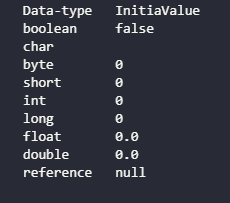

# 5.6 成员初始化

- Java尽力保证**所有变量在使用前都能得到恰当的初始化**  
- 类的每个基本类型数据成员保证都会有一个初始值  

``` java
package initialization;
//: initialization/initialValues.java
// Show default initial values

public class InitialValues{
    boolean t;
    char c;
    byte b;
    short s;
    int i;
    long l;
    float f;
    double d;
    InitialValues reference;

    void printInitialValues(){
        System.out.println("Data-type   InitiaValue");
        System.out.println("boolean     "+t);
        System.out.println("char        "+c);
        System.out.println("byte        "+b);
        System.out.println("short       "+s);
        System.out.println("int         "+i);
        System.out.println("long        "+l);
        System.out.println("float       "+f);
        System.out.println("double      "+d);
        System.out.println("reference   "+reference);
    }

    public static void main(String[] args) {
        InitialValues iv=new InitialValues();

        iv.printInitialValues();

        //  new InitialValues().printInitialValues();
    }
}/*OutPut:
Data-type   InitiaValue
boolean     false
char        
byte        0
short       0
int         0
long        0
float       0.0
double      0.0
reference   null
*///:~
```

  

- 在类里定义一个对象引用时,如果不将其初始化,此引用就会获得一个特殊值null  

## 5.6.1 指定初始化  

- 直接提供初始值  

``` java
//: initialization/InitialValudes2.java
// Provide explicit initial values
public class InitialValues2{
    boolean bool=true;
    char ch='x';
    byte b=47;
    short s=0xff;
    int i=999;
    long lng=1;
    float f=3.14f;
    double d=3.14159;
}///:~
```

- 也可以用同样的方法初始化非基本类型的对象

```java
//: initialization/Measurement.java
class Depth{}
public class Measurement{
    Depth d=new Depth();
    //...
}///:~
```